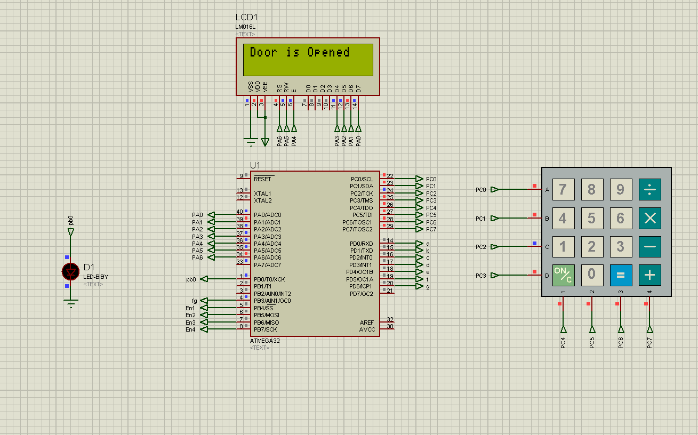

# Locker-System-based-on-ATMEGA32
In this project includes all the drivers from scratch.

Locker System description:

## Locker System Demo 

## System Componenets

1. Keypad
2. LCD 
3. LED
4. EEPROM

## ProjectDetails

1. Pressing on any button will make LED on for 100msec.
2. First time password saved is 0000.
3. User should enter 0000 to open locker at first time.
4. To change password user should press on ‘/’  buzzer will be on for 3 second
then off  user should enter 4 digit password

5. To close the locker, you should press only on ‘*’

6. To open the locker, enter 4 digit password (lcd display * each time you enter a
digit for password, then display locker opened if right password and Try again if
wrong password and a buzzer will be on for 3 second then off  re-enter
password again.

7. To open the locker, enter 4 digit password (lcd display * each time you enter a
digit for password, then display locker opened if right password and Try again if
wrong password and a buzzer will be on for 3 second then off  re-enter
password again.

## Simulation
https://drive.google.com/drive/folders/1L3JVhJxyFXEfJbJFN1wX6mdpCvRvKkJg?fbclid=IwAR32Zlghqeuyf8ksncDxB5KRXSZ3Gb3tMAuHc8w8DzcmAEM_L9NN0EMmA0A
